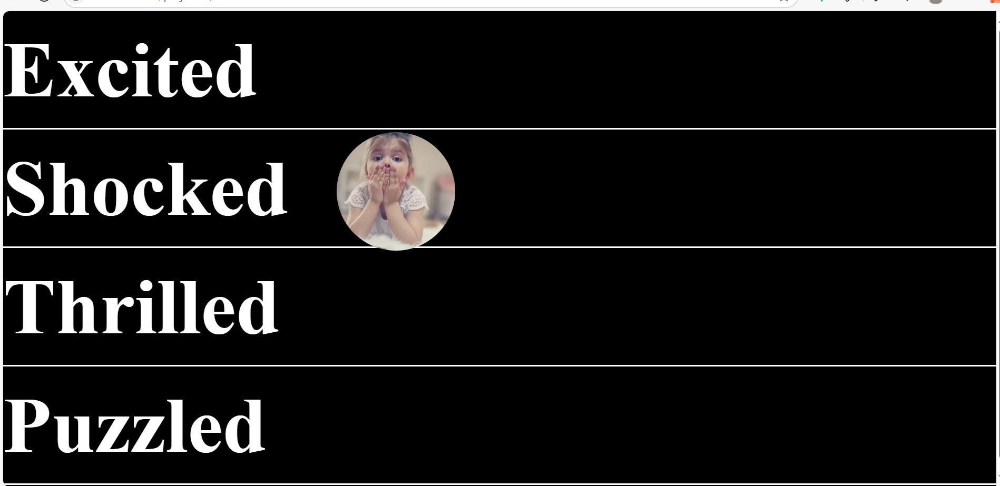
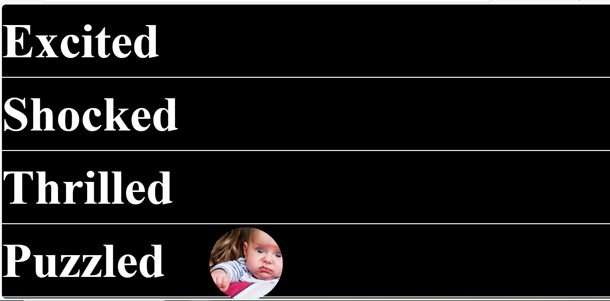

# 🖱️ JS Hover Image Follow Effect

An interactive mini project where an image appears and follows your mouse when you hover over different words like *Excited*, *Shocked*, etc.

Built using pure HTML, CSS, and JavaScript.

---

## ✨ Features

- 🖱️ Cursor-following image on hover
- 💥 Smooth transitions using CSS
- 🧠 DOM manipulation with `querySelectorAll`
- 📱 Responsive layout for large screens

---

## 🚀 How It Works

- When you hover over each `.elm` div, the image fades in.
- As you move your mouse, it updates the image position using `event.clientX` and `event.clientY`.
- On `mouseleave`, the image fades out smoothly.

---

## 📸 Preview

---

## 📂 Tech Stack

- HTML
- CSS
- JavaScript (Vanilla)

---

## 👩‍💻 Author

Made with ❤️ by **Nikita Gupta**  
[GitHub Profile → coder-nikita](https://github.com/coder-nikita)
